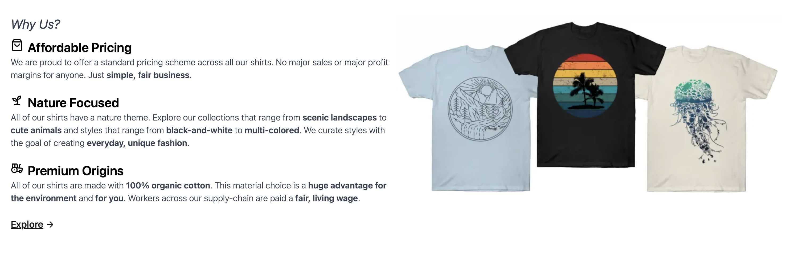
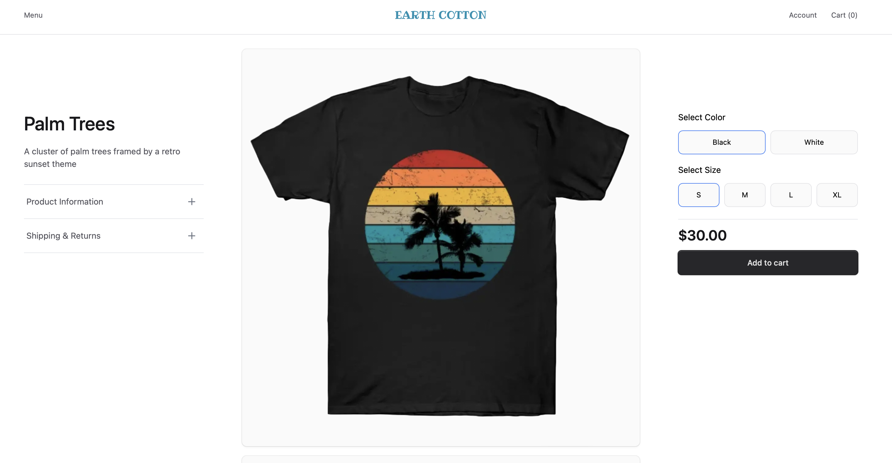
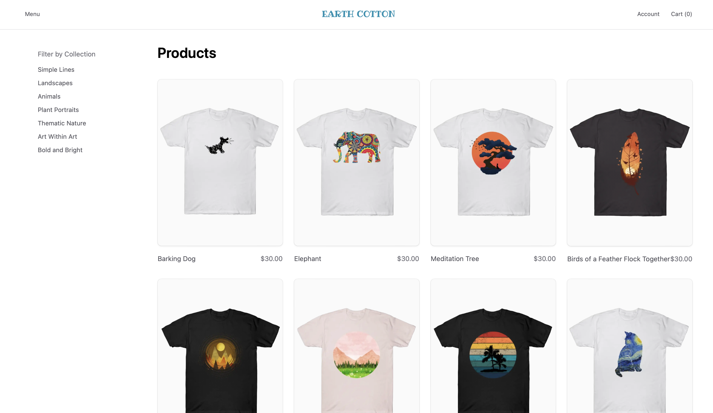
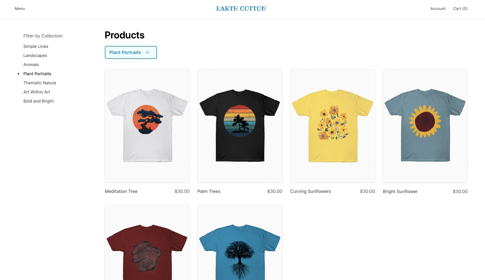

# Ecommerce Storefront

This project is the frontend for an ecommerce storefront application. The app UI features a sample clothing company, Earth Cotton.

## Overview

The `ecommerce-storefront` is built with:

- [Medusa](https://medusajs.com/)
- [Next.js](https://nextjs.org/)
- [Tailwind CSS](https://tailwindcss.com/)
- [Typescript](https://www.typescriptlang.org/)

Features include:

- Full ecommerce support:

  - Home Page
    
    
  - Product Detail Page
    
  - Product Overview Page
    
  - Product Collections
    
  - Cart
  - Checkout with Stripe
  - User Accounts
  - Order Details

- Full Next.js 15 support:
  - App Router
  - Next fetching/caching
  - Server Components
  - Server Actions
  - Streaming
  - Static Pre-Rendering

## How to Run

### Prerequisites

- Follow the installation steps [here]() for the companion ecommerce backend. The backend repo name is `ecommerce`.
- Product images are hosted on the cloud, such as an AWS S3 bucket. Make a note of the base URL of your hosting service. For example, below is a hostname for AWS S3 (which is a dummy value), `commerce-project-a0a96fd3-afdd-49c0-b6fd-ccd23bc15def.s3.us-west-1.amazonaws.com`

### Clone the repository

- Use `git clone` to clone this repo.

### Set up the environment variables

- Navigate into your project directory and set up the `.env.local` file. Update the `.env` values accordingly:

```shell
cd ecommerce-storefront/
mv .env.template .env.local
```

### Install dependencies

- Use yarn or npm to install all dependencies.

```shell
yarn
```

or

```shell
npm install
```

### Run the app

- Start the frontend server

```shell
yarn dev
```

or

```shell
npm run dev
```

The ecommerce storefront is now running at http://localhost:8000!

## Resources

### Medusa

This project was scaffolded with `create-medusa-app`, an open-source ecommerce framework. Below are resources to learn more.

- [Website](https://www.medusajs.com/)
- [GitHub](https://github.com/medusajs)
- [Documentation](https://docs.medusajs.com/)

### Data Sourcing

The sample company, Earth Cotton, is fictitious. The product images are taken from the ecommerce website [TeePublic](https://www.teepublic.com/t-shirts). The project is purely for software development purposes with no commercial intent.
